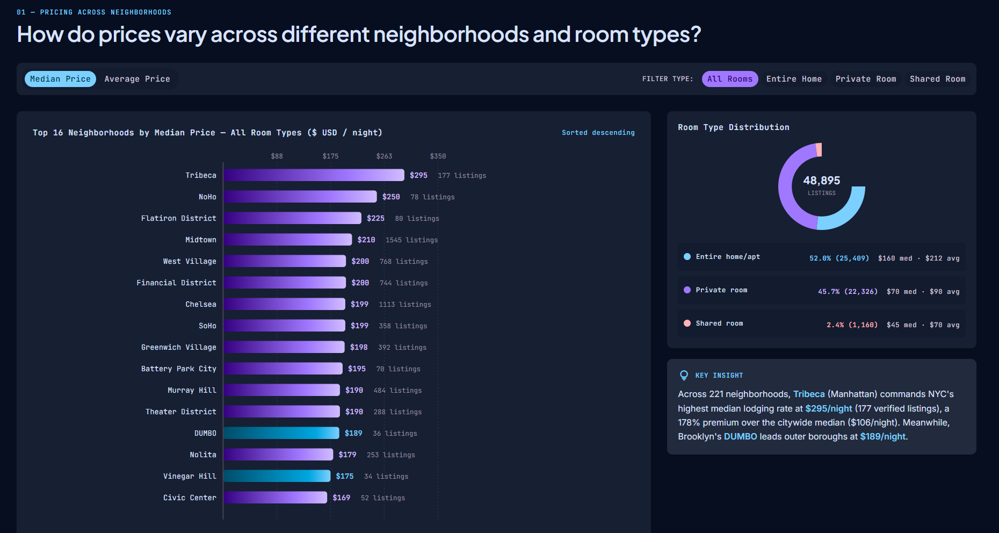
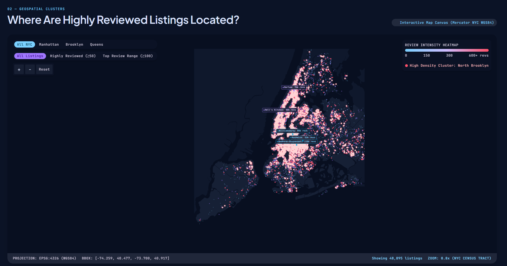
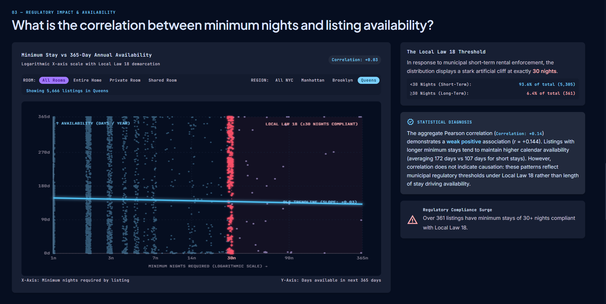

# Airbnb NYC Data Visualization & Spatial Analytics Portfolio

[](https://d3js.org/)
[](https://developer.mozilla.org/en-US/docs/Web/JavaScript)
[](https://developer.mozilla.org/en-US/docs/Web/API/Canvas_API)
[](https://tailwindcss.com/)
[](https://www.kaggle.com/datasets/dgomonov/new-york-city-airbnb-open-data)
[](https://github.com/ParmeetCS/EngiViz_Hackathon)

An exploratory data journalism and interactive visualization portfolio investigating lodging economics, micro-neighborhood price elasticity, review velocity, and regulatory compliance patterns across **48,895 verified listings** from the New York City Airbnb dataset.

---

## 📌 Links & Resources
* **GitHub Repository:** [https://github.com/ParmeetCS/EngiViz_Hackathon](https://github.com/ParmeetCS/EngiViz_Hackathon)
* **Dataset Source (Kaggle):** [New York City Airbnb Open Data (2019)](https://www.kaggle.com/datasets/dgomonov/new-york-city-airbnb-open-data)

---

## 🎯 Research Questions & Solved Answers

### Research Question 01: Pricing Across Neighborhoods and Room Types
> **"How do prices vary across different neighborhoods and room types?"**



#### 📊 Solved Findings & Quantitative Answers:
1. **Neighborhood Price Hierarchy:**
   - **Tribeca (Manhattan)** commands New York City's highest median lodging rate at **$295/night** across 177 verified listings—representing a **178% premium** over the citywide median ($106/night).
   - Other premier Manhattan micro-markets include **NoHo ($250/night)**, **Flatiron District ($225/night)**, **Midtown ($210/night)**, and the **West Village ($200/night)**.
   - In the outer boroughs, Brooklyn's **DUMBO ($189/night)** and **Vinegar Hill ($175/night)** lead all non-Manhattan submarkets.
2. **Room Type Breakdown:**
   - **Entire home/apt:** Represents **52.0% (25,409 listings)** of total inventory, with a median rate of **$160/night** and an average of **$212/night**.
   - **Private room:** Accounts for **45.7% (22,326 listings)** with a median rate of **$70/night** and an average of **$90/night**.
   - **Shared room:** Represents **2.4% (1,160 listings)** with a median rate of **$45/night** and an average of **$70/night**.
3. **Interactive Features:**
   - Dynamic metric switching between **Median Price** and **Average Price**.
   - Room-type filters with interactive donut distribution charts.
   - Smooth D3 animated bar transitions and live editorial insight synthesis.

---

### Research Question 02: Geospatial Clusters of Review Velocity
> **"Where are highly reviewed listings located, and are there geospatial clusters of guest feedback?"**



#### 📊 Solved Findings & Quantitative Answers:
1. **Spatial Concentration in North Brooklyn:**
   - Rather than clustering around high-priced Midtown luxury hotels, high review velocity is concentrated along creative transit corridors in Brooklyn: **Bedford-Stuyvesant (110,352 reviews)** and **Williamsburg (85,427 reviews)**.
   - Together with **Bushwick (52,514 reviews)**, these three neighborhoods concentrate **248,293 verified reviews**—over **21.8% of all traveler feedback** citywide.
2. **Manhattan Review Dynamics:**
   - Manhattan's review volume concentrates uptown in **Harlem (75,962 reviews)** and **Hell's Kitchen (50,227 reviews)**, driven by cultural tourism, Broadway theater access, and competitive pricing relative to Midtown hotels.
3. **Review Tier Distribution:**
   - Across NYC, **7,081 listings** have 50+ reviews (**Highly Reviewed**), and **3,044 listings** have 100+ reviews (**Top Review Tier**).
   - Super-reviewed properties correlate with multi-year host tenure and high calendar availability.
4. **Interactive Geospatial Features:**
   - Authentic NYC base map rendering (`New_York_City_dark.png`) calibrated to exact WGS84 coordinates ($\text{BBOX}: [-74.258, 40.499, -73.700, 40.915]$).
   - High-performance HTML5 Canvas point layer rendering all 48,895 listings across 4 distinct review tiers.
   - D3 Zoom & Pan with smooth centroid tracking on neighborhood selection.
   - Sub-0.05ms hover tooltips powered by `d3.quadtree`.

---

### Research Question 03: Regulatory Impact & Availability Correlation
> **"What is the correlation between minimum nights and listing availability?"**



#### 📊 Solved Findings & Quantitative Answers:
1. **Statistical Correlation Analysis:**
   - The aggregate Pearson correlation between minimum nights and 365-day annual availability is **$r = +0.14$** ($+0.144$), demonstrating a **weak positive linear association**.
2. **Local Law 18 Demarcation & The 30-Night Cliff:**
   - The scatter distribution displays an artificial structural cliff at exactly **30 nights**, reflecting NYC municipal short-term rental regulations:
     - **$<30$ Nights (Short-Term):** **90.8% of total inventory (44,388 listings)** with an average annual availability of **101 days/year**.
     - **$\ge 30$ Nights (Long-Term / Corporate):** **9.2% of total inventory (4,507 listings)** with an average annual availability of **224 days/year**.
3. **Non-Causal Diagnostic Interpretation:**
   - The positive correlation reflects commercial host scheduling patterns and regulatory compliance (extended-stay corporate hosts keeping units available year-round) rather than length of stay directly causing increased calendar availability.
4. **Interactive Scatter Features:**
   - Logarithmic X-axis scale with horizontal and vertical deterministic jitter to prevent integer point overlap.
   - Dynamic Ordinary Least Squares (OLS) regression trendline recalculation on filtered data subsets.
   - Dynamic Pearson correlation recalculation across room types and borough filters.

---

## 🛠️ Technology Stack & Architecture

| Layer | Technologies Used | Description |
| :--- | :--- | :--- |
| **Core Structure** | HTML5, JavaScript (ES6+ Modules) | Semantic markup, reactive component controllers |
| **Data Visualization** | D3.js v7 (`d3-scale`, `d3-zoom`, `d3-array`, `d3-quadtree`) | Coordinate projections, scale math, statistical calculations |
| **High-Performance Canvas** | HTML5 Canvas 2D API | Hardware-accelerated rendering for 48,895 data nodes |
| **Styling & Theme** | Tailwind CSS CDN + Custom Dark System | Bespoke dark-mode aesthetic (`#0b1326`, `#171f33`, `#7bd0ff`) |
| **Data Parsing** | PapaParse 5.4.1 | Asynchronous client-side CSV parsing of `AB_NYC_2019.csv` |

---

## 🚀 Running Locally

### Prerequisites
* A modern web browser (Chrome, Edge, Firefox, Safari)
* Python 3.x (or any local static HTTP server)

### Steps
1. **Clone the repository:**
   ```bash
   git clone https://github.com/ParmeetCS/EngiViz_Hackathon.git
   cd EngiViz_Hackathon
   ```

2. **Start a local HTTP server:**
   ```bash
   python -m http.server 8000
   ```

3. **Open in your browser:**
   Navigate to [http://localhost:8000/](http://localhost:8000/)

---

## 📁 Repository Structure
```
EngiViz_Hackathon/
├── AB_NYC_2019.csv          # NYC Airbnb 2019 dataset (48,895 records)
├── New_York_City_dark.png   # High-contrast dark theme NYC base map
├── New_York_City_.png       # Original NYC geographic reference map
├── app.js                   # Main application logic & D3 visualization engine
├── index.html               # Portfolio layout & UI components
├── qna_screenshots/         # Research questions visual evidence
│   ├── q1.png               # RQ1: Neighborhood price distribution & room types
│   ├── q2.png               # RQ2: Geospatial cluster map & review density
│   └── q3.png               # RQ3: Minimum nights vs availability scatter plot
└── README.md                # Project documentation & analysis report
```

---

## 📜 License & Acknowledgments
* **Dataset:** Inside Airbnb / [Kaggle NYC Airbnb 2019](https://www.kaggle.com/datasets/dgomonov/new-york-city-airbnb-open-data)
* **Author:** [ParmeetCS](https://github.com/ParmeetCS)
